# M3DS Layouts  
Note for the purpoes of showing where screens are, these images are captured with 'Setup3DS(...,wide = true)'.  
If wide is disabled, the Top 3DS screen will fill the entire viewport.
## Conventional  

**MDS_VStack(clip c, int "frame", int "frame2")**  
**MDS_VstackA(clip c, int "frame", int "frame2")**  
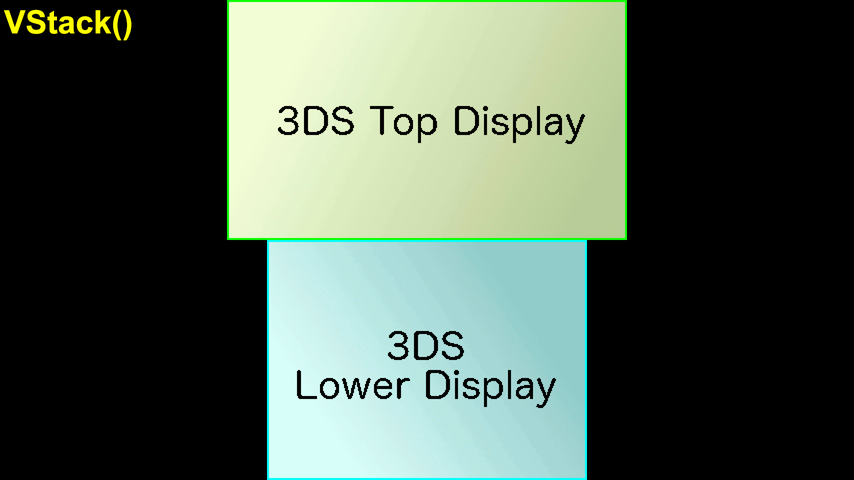  
2x magnification. Stacked vertically.  

**MDS_VStackGap(clip c, int "frame", int "frame2", string "gap")**  
**MDS_VStackGapA(clip c, int "frame", int "frame2", string "gap")**  
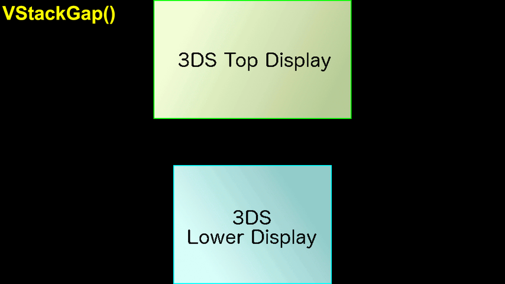  
Stacked vertically with an effectively 92 (default) pixel gap between the screens.  

**MDS_TopV(clip c, int "frame", int "frame2")**  
**MDS_TopVA(clip c, int "frame", int "frame2")**  
  
4x magnification. Top screen centered, Bottom Screen centered but off screen below.  

**MDS_BotV(clip c, int "frame", int "frame2")**  
**MDS_BotVA(clip c, int "frame", int "frame2")**  
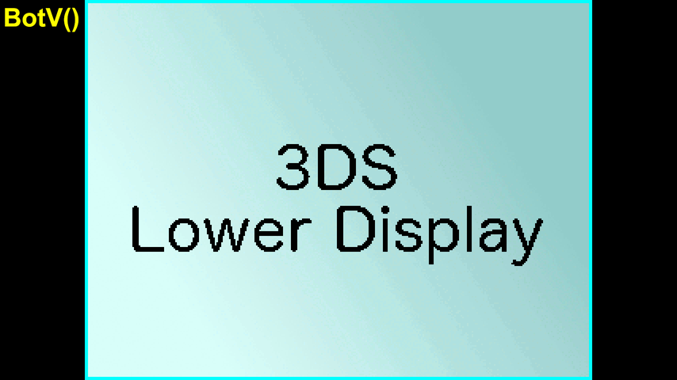  
4x magnification. Bottom screen centered, Top Screen centered but off screen above.  

**MDS_TopH(clip c, int "frame", int "frame2")**  
**MDS_TopHA(clip c, int "frame", int "frame2")**  
  
4x magnification. Top screen centered, Bottom Screen off screen to the right.  

**MDS_BotH(clip c, int "frame", int "frame2")**  
**MDS_BotHA(clip c, int "frame", int "frame2")**  
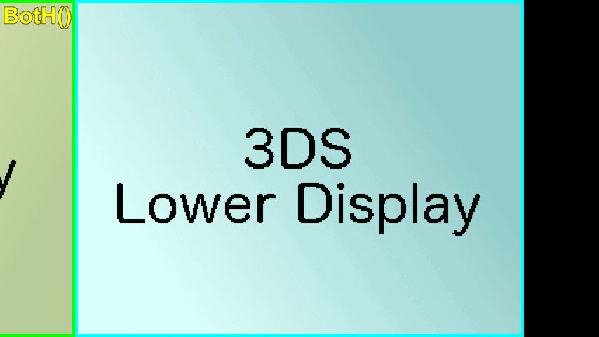  
4x magnification. Bottom screen centered, Top Screen but off screen to the left.  

**MDS_QuickTop(clip c, int "frame", int "frame2")**  
**MDS_QuickTopA(clip c, int "frame", int "frame2")**  
  
4x magnification. Bring Top screen in over the Bottom.  

**MDS_QuickBot(clip c, int "frame", int "frame2")**  
**MDS_QuickBotA(clip c, int "frame", int "frame2")**  
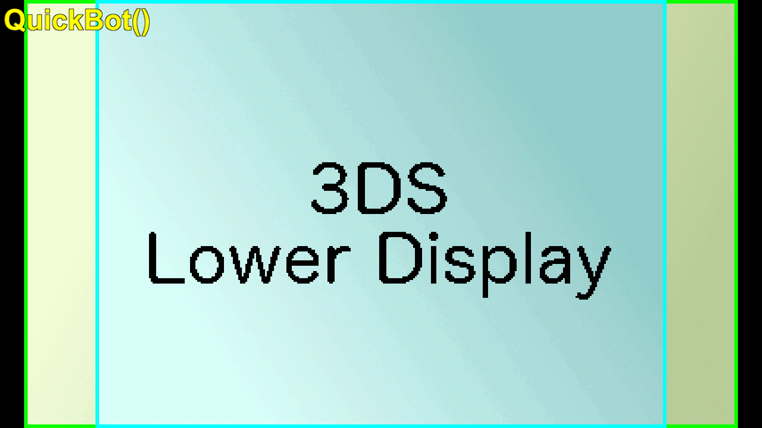  
4x magnification. Bring Bottom screen in over the Top.  

**MDS_TopO(clip c, int "frame", int "frame2")**  
**MDS_TopOA(clip c, int "frame", int "frame2")**  
  
Top screen @ 4x, centered. Bottom screen @ 1x out of the viewport to the lower right.  

**MDS_BotO(clip c, int "frame", int "frame2")**  
**MDS_BotOA(clip c, int "frame", int "frame2")**  
  
Bottom screen @ 4x, centered. Top screen @ 1x out of the viewport to the upper left.  

**MDS_TPIP(clip c, int "frame", int "frame2")**  
**MDS_TPIPA(clip c, int "frame", int "frame2")**  
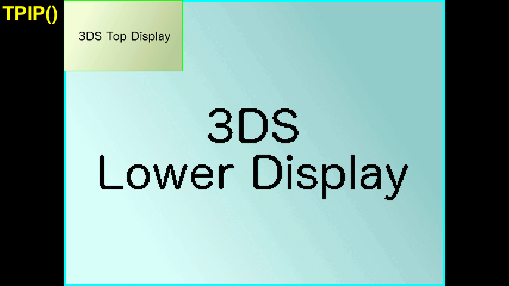  
Top screen @ 4x, centered. Bottom screen @ 1x overlayed lower right corner.  

**MDS_BPIP(clip c, int "frame", int "frame2")**  
**MDS_BPIPA(clip c, int "frame", int "frame2")**  
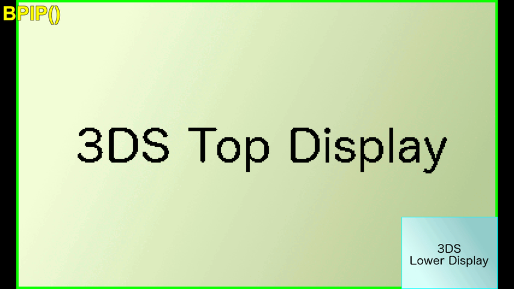  
Bottom screen @ 4x, centered. Top screen @ 1x overlayed upper left corner.  

**MDS_TopC(clip c, int "frame", int "frame2")**  
**MDS_TopCA(clip c, int "frame", int "frame2")**  
  
Top screen @ 4x, centere of viewport due to size. Bottom screen @ 1x, lower right corner.  

**MDS_BotC(clip c, int "frame", int "frame2")**  
**MDS_BotCA(clip c, int "frame", int "frame2")**  
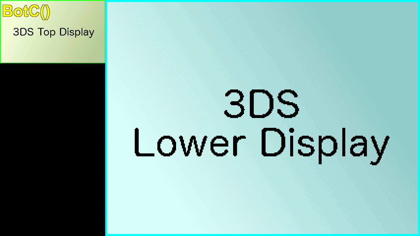  
Bottom screen @ 4x, right side. Top screen @ Whatever's left, upper left corner.  

## Side by Side

**MDS_SBS(clip c, int "frame", int "frame2")**  
**MDS_SBSA(clip c, int "frame", int "frame2")**  
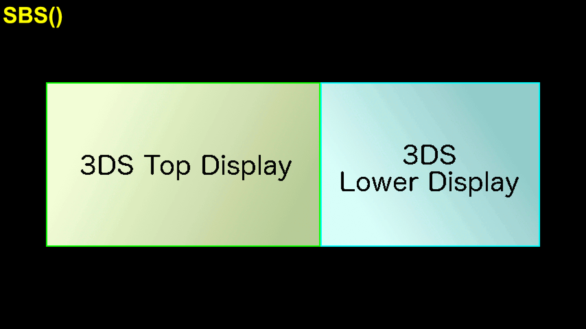  
2x magnification. Top screen on left, Bottom on right.  

**MDS_SBSL(clip c, int "frame", int "frame2")**  
**MDS_SBSLA(clip c, int "frame", int "frame2")**  
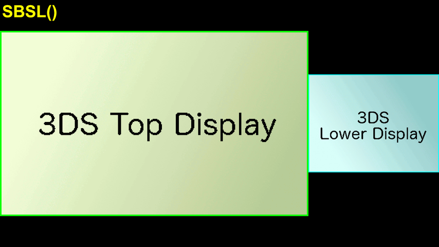  
Top screen on left @ 3x, Bottom on right @ whatever's left.  

**MDS_SBSR(clip c, int "frame", int "frame2")**  
**MDS_SBSRA(clip c, int "frame", int "frame2")**  
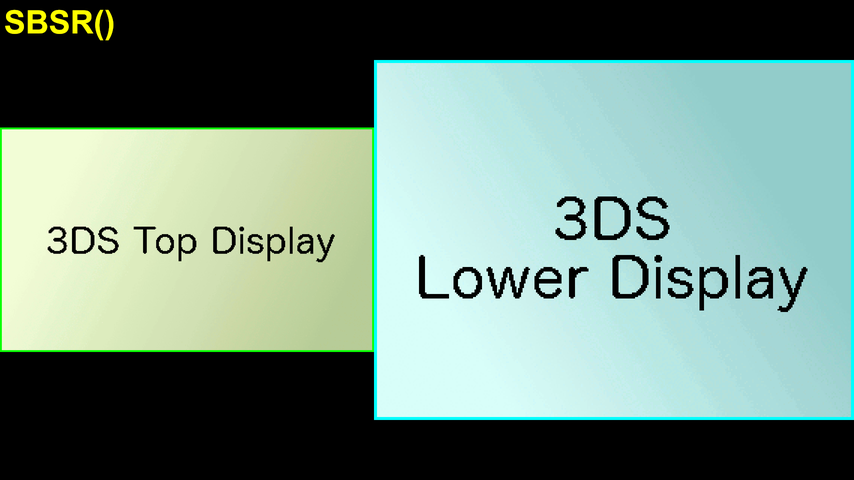  
Bottom on right @ 3x, Top screen on left @ whatever's left.

## 'Book' style

**MDS_Book(clip c, int "frame", int "frame2", bool "RightInstead")**  
**MDS_BookA(clip c, int "frame", int "frame2", bool "RightInstead")**  
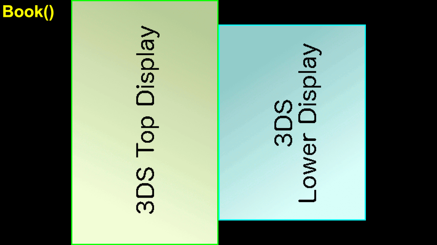  
Book mode (ie, rotated 90 degrees) with no gap. Set RightInstead to true to rotate clockwise.  

**MDS_BookCGap(clip c, int "frame", int "frame2", bool "RightInstead")**  
**MDS_BookCGapA(clip c, int "frame", int "frame2", bool "RightInstead")**  
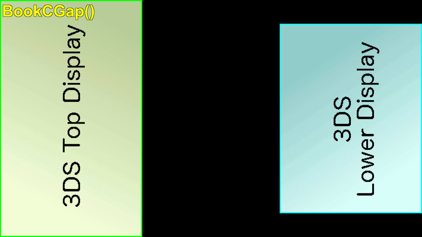  
Book mode (ie, rotated 90 degrees) with screens placed as far apart as they can be. Set RightInstead to true to rotate clockwise.  

**MDS_BookGap(clip c, int "frame", int "frame2", string "gap", bool "RightInstead")**  
**MDS_BookGapA(clip c, int "frame", int "frame2", string "gap", bool "RightInstead")**  
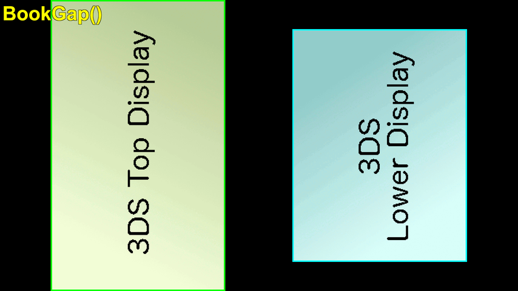  
Book mode (ie, rotated 90 degrees) with screens with an effective gap of 92 (default) pixels. Set RightInstead to true to rotate clockwise.  

**MDS_Book_VStackScale(clip c, int "frame", int "frame2", bool "RightInstead")**  
**MDS_Book_VStackScaleA(clip c, int "frame", int "frame2", bool "RightInstead")**  
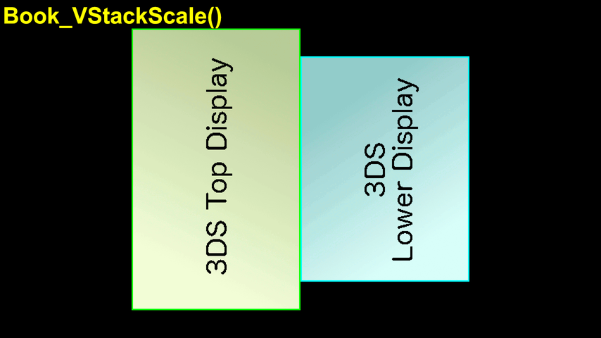  
2x magnification, is effectively rotated VStack.  
